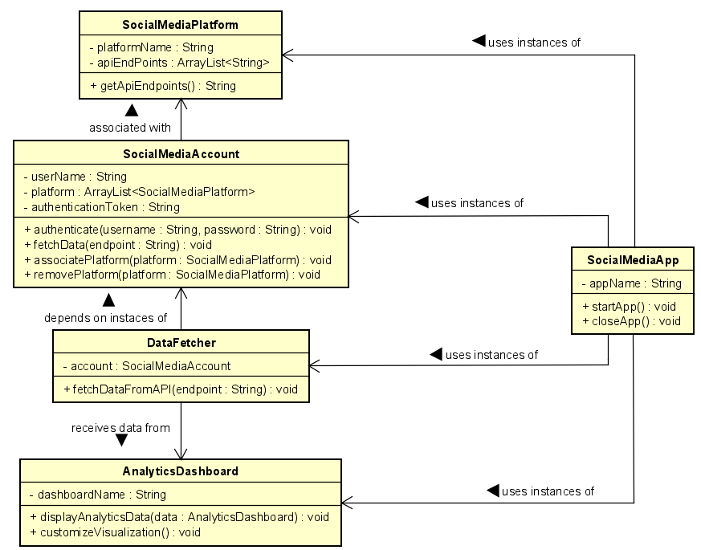

# Social Pulse Insight Hub
## NHL Stenden | Final Assignment | Threading in C#

### Table of Content
- [1. Objective](#1-objective)
- [2. Components](#2-components)
- [3. Define Features](#3-define-features)
- [4. Timeline](#4-project-timeline)
- [5. User Stories](#5-user-stories)
- [6. Test Plan](#6-test-plan)
- [7. Risks Analysis](#7-risks-and-mitigation-strategies)
- [8. Feedback Section](#8-feedback-section)
- [9. Continuous Improvement](#9-continuous-improvement)
- [10. Additional Information](#10-additional-information)

### 1. Objective
Develop a C# .NET Maui application that allows users to analyze and visualize social media data from multiple platforms.
The application should use multi-threading, PLINQ, and provide a clean GUI for users to interact with the analytics dashboard.

### 2. Components
#### 2.1 Requirements
| Components | Description |
| --- | --- |
| C# .NET 8.0 or Higher | Utilize the latest version of C# .NET for application development. |
| Multi-Threading | Implement multi-threading techniques, such as PLINQ, to efficiently process and analyze social media data concurrently. |
| .NET Maui | Build the application using .NET Maui, ensuring cross-platform compatibility for both Android and iOS devices. |
| Clean GUI | Design an intuitive graphical user interface (GUI) for users to connect their social media accounts, view analytics, and customize data visualizations. |
| Version Control | Implement version control using Git to track changes, collaborate within the group, and ensure a smooth development process. |

#### 2.2 Functional
| Components | Description |
| --- | --- |
| Social Media Integration | Allow users to connect and authenticate with multiple social media platforms (e.g., Twitter, Facebook, Instagram). |
| Data Fetching | Fetch and process social media data using multiple asynchronized I/O calls to the respective APIs. |
| Analytics Dashboard | Display analytics such as post engagement, follower growth, and popular hashtags. Utilize PLINQ for efficient data processing. |
| Real-time Updates | Implement real-time updates for social media metrics using the thread pool, ensuring timely information for users. |
| Data Visualization | Use plots and graphs to visually represent social media analytics. Allow users to customize and interact with the visualizations. |

#### 2.3 Unified Modeling Language (UML)
| Class | Description |
| --- | --- |
| SocialMediaApp | Acts as the main application class. Manages the overall functionality and coordination of different components. |
| SocialMediaAccount | Represents a user's social media accounts. Contains information such as username, authentication tokens, etc. |
| SocialMediaPlatform | Represents different social media platforms like Twitter, Facebook, Instagram, etc. May contain information about API endpoints, authentication mechanisms, etc. |
| DataFetcher | Responsible for fetching social media data from APIs. | Utilizes authentication credentials from SocialMediaAccount to access data. |
| AnalyticsDashboard | Manages the display of analytics data obtained from social media platforms. Provides tools for visualization, customization, etc. | 

### 3. Define Features
| Name | Version | Date | Note |
| --- | --- | --- | --- |
| Visual Studio 2022 | 17.8 | January 22, 2024 | The official source of the project. |
| .NET Maui | - | February 6, 2023 | .NET Multi-platform App UI development. | 
| .NET Framework | 8.0.201 | February 13, 2024| Language support: C# 12.0, Visual Basic 16.9 |
| GitHub | 3.11.4 | January 30, 2024 | Version Control for the project. |
| PLINQ | - | - | Identify areas for parallel processing in data fetching and analysis. |

#### 3.1 .NET MAUI
It provides a cross-platform framework for building native applications, and it comes with built-in support for creating visually appealing and interactive user interfaces, including data visualization components. It allows you to bind your data directly to the UI components. Ensure that your chosen visualization library supports data binding, enabling you to dynamically update visualizations based on real-time data from social media platforms. Consider the responsive design principles provided by .NET MAUI to ensure that your visualizations adapt well to different screen sizes and orientations across various devices.

#### 3.2 PLINQ
| Title | Description |
| --- | --- |
| Data Processing: | If your application involves processing large sets of social media data, PLINQ can help parallelize operations like filtering, sorting, and aggregating, improving overall performance. |
| Analytics Dashboard: | When calculating analytics metrics such as post engagement, follower growth, or popular hashtags, PLINQ can be employed to parallelize computations and speed up the generation of insights. |
| Real-Time Updates: | If your application includes real-time updates for social media metrics, PLINQ can be used to efficiently process incoming data from multiple sources concurrently. |
| Data Visualization: | Depending on the complexity of your visualizations, PLINQ can aid in parallelizing data transformations before rendering graphs and charts. |

## 4. Project Timeline
| Phase | Date | Description |
| --- | --- | --- |
| System Architecture | March 1 - 15, 2024 | Define the overall application. Write Start Document. |
| Database Design | March 15, 2024 | Plan the structure of the database to store user data and analytics metrics. |
| User Interface Mockups | March 15, 2024 | Create and finalize mockups for the analytics dashboard and user settings. |
| Kick-off | March 15 - 17, 2024 | Present the idea for the lecturer. |
| Development | March 18 - 31, 2024 | Create a project and build up the starting structures of the project. Add APIs. Adjust visualization. Add social media registration. |
| Testing | March 18 - 31, 2024 | Test the features and fix the project. |
| Submit | March 30, 2024 | Hand in the project with all the necessary documents and folders. |
| Presentation | March 31, 2024 | Present the work you have done. |

### 5. User Stories
#### 5.1 Must-Have
| Title | Description |
| --- | --- |
| User Authentications | As a user, I want to log in securely to access my social media analytics dashboard. |
| Social Media Integration | As a user, I want to connect and authenticate my social media accounts (Facebook, Instagram, X, Snapchat, Thread, etc.) to the dashboard. |
| Data Fetching | As a user, I want to fetch data from connected social media platforms (Facebook, Instagram, X, Snapchat, Thread, etc.) to view analytics. |
| Real-Time Updates | As a user, I want to receive real-time updates on social media metrics such as post engagement, follower growth, etc. |
| Analytics Dashboard | As a user, I want to view and analyze social media analytics in a visually appealing dashboard. |
| Data Visualization | As a user, I want to visualize social media analytics data using plots, graphs, and charts for better insights. |

#### 5.2 Should-Have
| Title | Description |
| --- | --- |
| Customizable Data Visualization | As a user, I should be able to customize and interact with data visualization (e.g., filter data) to tailor them to my needs. |
| Multi-Platform Support | As a user, I should be able to access the application and view the analytics dashboard from multiple platforms (e.g., desktop, and mobile). |
| Responsive Design | As a user, I should be able to experience a responsive design that adapts well to different screen sizes and orientations across various devices. |

#### 5.4 Could-Have
| Title | Description |
| --- | --- |
| Predictive Analytics | As a user, I could predict analytics features that forecast future trends based on historical data. |
| Collaboration Features | As a user, I could collaborate with team members by sharing analytics dashboards and insights. |
| Social Media Scheduling | As a user, I could schedule social media posts directly from the analytics dashboard. |

#### 5.4 Won't-Have
| Title | Description |
| --- | --- |
| Advanced Machine Learning Models | As a user, I will not have access to advanced machine learning models for predictive analytics due to resource constraints. |
| Built-in Social Media Posting | As a user, I will not have the ability to post directly to social media platforms from the dashboard. |

### 6. Test Plan
#### 6.1 Authentication
##### Objective: Ensure users can securely log in to the application.
| Step | Title | Description | Expected Result |
| --- | --- | --- | --- |
| 6.1.1 | Valid credentials | Verify that valid credentials allow access to the dashboard. | Successful login. |
| 6.1.2 | Invalid credentials | Verify that invalid credentials are rejected with appropriate error messages. | Send an error message to the user. |
| 6.1.3 | Forgot password | Test the functionality of the "Forgot Password" feature. | Change password functionality works properly and the user can log in with the new password. |

#### 6.2 Social Media Integration
##### Objective: Verify that users can successfully connect and authenticate their social media accounts.
| Step | Title | Description | Expected Result |
| --- | --- | --- | --- |
| 6.2.1 | Integration | Test the integration with various social media platforms. | Successful integration with social media platforms. |
| 6.2.2 | Revoke | Ensure that users can revoke access to connected accounts. | Able to revoke the connection between the accounts. |
| 6.2.3 | Error handling | Test the handling of authentication errors and prompts for reauthentication. | Proper error handling for security reasons. |

#### 6.3 Data Fetching
##### Objective: Validate that the application can fetch data from connected social media platforms.
| Step | Title | Description | Expected Result |
| --- | --- | --- | --- |
| 6.3.1 | Data fetch | Verify that data is fetched accurately and promptly. | Up-to-date data analysis is shown on the dashboard. |
| 6.3.2 | API | Test the handling of API rate limits and errors. | API works properly. |
| 6.3.3 | Data match | Ensure that fetched data matches expectations and is consistent across platforms. | Correct data is presented on the dashboard. |

#### 6.4 Analytics Dashboard
##### Objective: Ensure that the analytics dashboard displays data accurately and effectively.
| Step | Title | Description | Expected Result |
| --- | --- | --- | --- |
| 6.4.1 | Analytics | Verify that all analytics metrics (e.g., post engagement, follower growth, popular hashtags) are displayed correctly. | Correct data are displayed. |
| 6.4.2 | Performance | Test the performance and scalability of real-time updates with a large dataset. | The application is working properly despite a large number of datasets. |
| 6.4.3 | Notify | Ensure that users receive appropriate notifications for significant changes in metrics. | Send a notification or mail to the user about any changes. |

#### 6.5 Cross-Platform Compatibility
##### Objective: Validate that the application works seamlessly across different platforms and devices.
| Step | Title | Description | Expected Result |
| --- | --- | --- | --- |
| 6.5.1 | Web browser | Test the application on various web browsers (e.g., Chrome, Firefox, Explorer). | Proper performance on different web browsers. |
| 6.5.2 | Functionality | Verify the functionality and UI consistency on different operating systems (e.g., Windows and Android). | Proper performance on mobile and desktop. |

#### 6.6 Usability and Accessibility
##### Objective: Evaluate the usability and accessibility of the application for all users.
| Step | Title | Description | Expected Result |
| --- | --- | --- | --- |
| 6.6.1 | Alpha | Conduct usability testing with representative users to identify any usability issues. | Collect feedback from testers and update the application according to that. |
| 6.6.2 | Beta | Conduct usability testing with representative users to identify any usability issues. | Collect feedback from testers and update the application according to that. |

#### 6.7 Performance and Scalability
##### Objective: Assess the performance and scalability of the application under various conditions.
| Step | Title | Description | Expected Result |
| --- | --- | --- | --- |
| 6.7.1 | Response time | Test the application's response time and loading speed with different network conditions. | Quick and fast response time. |
| 6.7.2 | Usage | Conduct load testing to determine the application's performance under heavy user traffic. | Proper performance under heavy user traffic. |
| 6.7.3 | Structure | Evaluate the scalability of the application's backend infrastructure to handle increased data volume. | Proper backend structure. |

#### 6.8 Security
##### Objective: Ensure that the application adheres to security best practices and protects user data.
| Step | Title | Description | Expected Result |
| --- | --- | --- | --- |
| 6.8.1 | Vulnerabilities | Test for common security vulnerabilities (e.g., SQL injection, cross-site scripting) using automated scanning tools. | Successful scanning. |
| 6.8.2 | Sensitive data | Verify that sensitive user data is encrypted both in transit and at rest. | No leaking of any sensitive information about the users. |
| 6.8.3 | Penetration testing | Conduct penetration testing to identify and address potential security weaknesses. | Proper and successful testing. |

#### 6.9 Error Handling and Recovery
##### Objective: Validate that the application handles errors gracefully and provides appropriate error messages.
| Step | Title | Description | Expected Result |
| --- | --- | --- | --- |
| 6.9.1 | Troubleshooting | Verify that error messages are clear and informative, and help users troubleshoot issues. | Clear error messages for the users. |
| 6.9.2 | Recovery | Test the recovery process after encountering errors to ensure data integrity and application stability. | Professional recovery. |

#### 6.10 Integration Testing
##### Objective: Test the integration between different components and third-party services.
| Step | Title | Description | Expected Result |
| --- | --- | --- | --- |
| 6.10.1 | Process | Verify that data fetched from social media platforms is correctly processed and integrated into the analytics dashboard. | Proper and correct integration. |
| 6.10.2 | Connection | Test the interaction between the frontend UI and backend APIs for a seamless user experience. | Proper performance between the UI and the APIs. |

#### 6.11 Regression Testing
##### Objective: Ensure that recent code changes have not introduced any new defects or regressions.
| Step | Title | Description | Expected Result |
| --- | --- | --- | --- |
| 6.11.1 | Verify | Re-run previously executed test cases to verify that existing functionality remains unaffected. | Test until they are successful, safe and secure. |

### 7. Risks and Mitigation Strategies
#### 7.1 Risks
* Technical Complexity: Integrating multiple social media APIs and implementing real-time data updates may pose technical challenges.
* Resource Constraints: Limited availability of the student or access to necessary tools and technologies may impact project timelines and deliverables.
* Security Vulnerabilities: Inadequate security measures could result in data breaches or unauthorized access to sensitive user information.
* Scope Creep: Unclear or evolving project requirements may lead to scope creep, causing delays and budget overruns.
* Third-party Dependencies: Reliance on third-party services for social media integration may introduce risks related to service outages or changes to API functionality.
* User Adoption: Low user adoption or engagement with the application may indicate a lack of perceived value or usability issues.

#### 7.2 Mitigation Strategies
* Technical Prototyping: Conduct early prototyping to tackle technical challenges upfront.
* Team Training: Provide skill development opportunities to enhance team expertise.
* Security Audits: Regularly audit and test security measures to proactively address vulnerabilities.
* Incremental Delivery: Use iterative development to manage scope and prioritize features based on user feedback.
* API Diversification: Integrate alternative APIs to mitigate risks associated with service disruptions.
* User-Centric Design: Continuously gather user feedback to improve application usability and engagement.

### 8. Definition of Success
#### 8.1 Key Performance Indicators (KPIs)
* User Engagement: Measure the number of active users, session duration, and frequency of interactions with the application.
* Data Accuracy: Monitor the accuracy and reliability of social media analytics data displayed on the dashboard.
* Performance Metrics: Track application performance indicators such as response time, load time, and server uptime.
* User Satisfaction: Collect user feedback through surveys or reviews to assess satisfaction with the application's features and usability.
* Adoption Rate: Evaluate the rate of adoption among target users and identify factors influencing adoption or retention.
* Security Compliance: Ensure compliance with security standards and regulations, such as GDPR or HIPAA, to protect user privacy and data integrity.

#### 8.2 Success Criteria
* Achievement of Milestones: Successful completion of project milestones within defined timelines and budgets.
* Positive User Feedback: High satisfaction ratings and positive reviews from users regarding the application's functionality, performance, and user experience.
* Increased User Engagement: Growth in the number of active users and user engagement metrics over time.
* Accurate Analytics: Consistent delivery of accurate and reliable social media analytics data, validated through internal testing and user feedback.
* Adherence to Security Standards: Compliance with security standards and regulations, as validated through security audits and testing.
* Stakeholder Satisfaction: Satisfaction of project stakeholders, including sponsors, end-users, and team members, with the overall project outcomes and deliverables.

### 9. Feedback Section
| Date | Person | Title | Description | Updated Date | Done | Developer
| --- | --- | --- | --- | --- | --- | --- |
| 01-03-2024 | Rob Loves | ... | ... | 01-03-2024 | [] | Virag Szabo |
| 01-03-2024 | Rob Loves | ... | ... | 01-03-2024 | [] | Virag Szabo |
| 01-03-2024 | Rob Loves | ... | ... | 01-03-2024 | [] | Virag Szabo |
| 01-03-2024 | Rob Loves | ... | ... | 01-03-2024 | [] | Virag Szabo |
| 01-03-2024 | Rob Loves | ... | ... | 01-03-2024 | [] | Virag Szabo |

### 9. Continuous Improvement
| # | Title | Description |
| --- | --- | --- |
| 1 | Feature Enhancement | Continuously improve and enhance the application by adding new features based on user feedback and emerging trends in social media analytics. |
| 2 | Performance Optimization | Optimize the application's performance by refining algorithms, implementing caching mechanisms, or leveraging cloud services for scalability and reliability. |
| 3 | UI/UX Refinement | Conduct user testing and iterate on the user interface (UI) and user experience (UX) design to make the application more intuitive, visually appealing, and user-friendly. |
| 4 | Mobile Optimization | Further optimize the application for mobile devices by implementing responsive design principles, optimizing load times, and enhancing touch interactions. |
| 5 | Data Privacy and Security | Strengthen the application's data privacy and security measures by implementing additional encryption protocols, access controls, and compliance with industry standards and regulations. |
| 6 | Integration with Machine Learning | Explore opportunities to integrate machine learning algorithms for advanced analytics, sentiment analysis, or personalized recommendations based on user behaviour. |
| 7 | Community Engagement | Foster a community around the application by engaging with users, soliciting feedback, and collaborating with other developers or researchers in the field of social media analytics. |
| 8 | Portfolio Building | Showcase the application as part of my portfolio to demonstrate skills, expertise, and achievements to potential employers or collaborators in the industry. |
| 9 | Continuous Learning | Stay updated with the latest technologies, tools, and best practices in software development, data analytics, and social media marketing to further enhance my skills and knowledge. |

### 10. Additional Information
Virag Szabo | BS | Information Technology | March 2024
